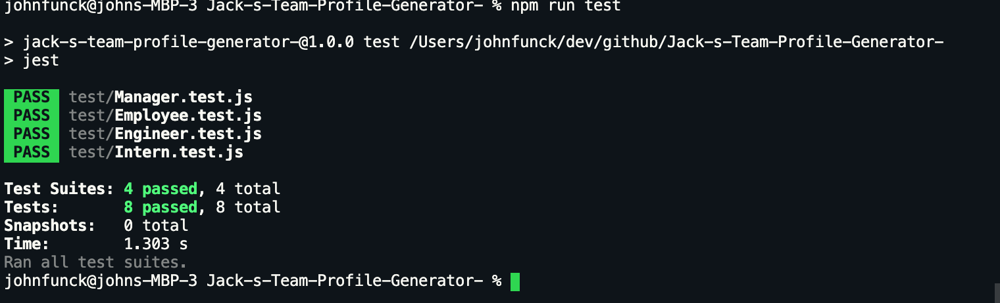

# Jack-s-Team-Profile-Generator

## Description
A software engineering team generator command line application utilizing node.js.


## How To Use
Run this command in your Command line
```
node index.js
npm run test
```
* Fill in the Manager prompts
* Select as many Engineers/Interns you would like to add to your team
* Fill in the information for selections
* When finished select "No"  for Would you like to enter another team member?.
* Navigate to the output folder and you will have a beautifully generated Html file of your team!

## Technologies Used
* Node.js
* JavaScript
* bootstrap


# Dependencies
* fs
* jest
* inquirer


# Tests


# Video


