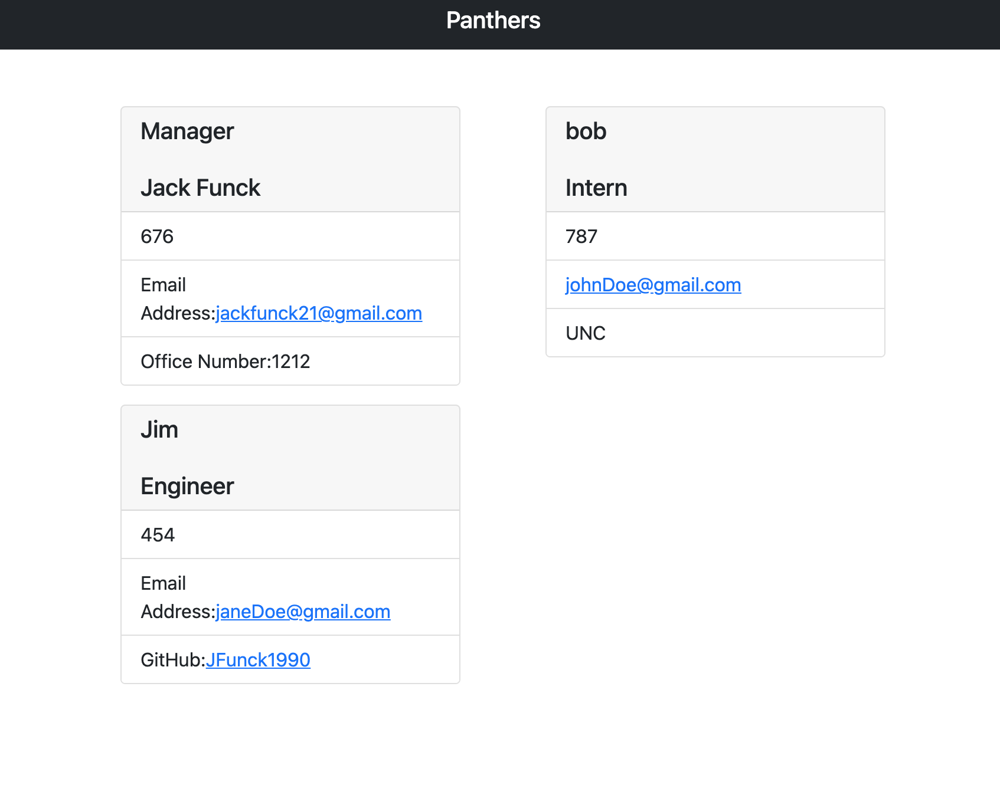

# Jack-s-Team-Profile-Generator
by: Jack Funck


## table of Contents:
 - [ Description. ](#desc)
 - [ Instructions. ](#instr)
 - [Technologies.](#tc)
 - [Dependencies](#dep)
 - [Tests.](#test)
 - [ Video. ](#video)
 - [Screen-Shots.](#sc)


<a name="desc"></a>
## Description
A software engineering team generator command line application utilizing node.js to build a team profile Website.


<a name="instr"></a>
## Instructions
Run this command in your Command line
```
node index.js
npm run test
```
* Fill in the Manager prompts
* Select as many Engineers/Interns you would like to add to your team
* Fill in the information for selections
* When finished select "No"  for "Would you like to enter another team member?".
* Then navigate to the output folder and you will have a beautifully generated Html file of your team!

<a name="tc"></a>
## Technologies Used
* Node.js
* JavaScript
* bootstrap

<a name="dep"></a>
# Dependencies
* fs
* jest
* inquirer

<a name="test"></a>
# Tests


<a name="video"></a>
# Video of how it works.
> If you click GIF you will be navigated to YouTube.

[](https://youtu.be/DGZz-zE3pP0)


<a name="sc"></a>
# Screen Shots

